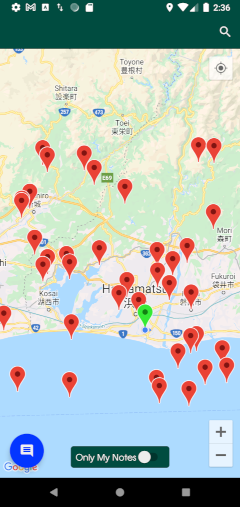
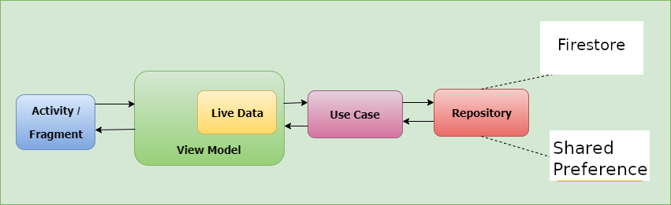

## Requirements
You are to create a simple mobile application – working title: *Landmark Remark*
- that allows users to save location based notes on a map. These notes can be
displayed on the map where they were saved and viewed by the user that
created the note as well as other users of the application.

__Backlog__
1. As a user (of the application) I can see my current location on a map
2. As a user I can save a short note at my current location
3. As a user I can see notes that I have saved at the location they were saved on the map
4. As a user I can see the location, text, and user-name of notes other users have saved
5. As a user I have the ability to search for a note based on contained text or user-name

__Implementation__
* Architecture

    * The application follows Android clean **MVVM** architecture.
    * Firestore is used as the database provider for the application. 
    * The application has __2 main screens__ : landing screen, and notes screen
    	* Because the note is user-based, so the application should have a screen to specify which user is using the app. that is what the landing screen does. It should be a login screen, but to simplify the application , we just assume that it is doing the user identification stuff. We enter the username, it verifies the profile and goes to the next screen. If that username does not exist, then we create a new profile from that username and go to the next screen.
    	* The main notes screen will perform almost all the stories backlog above. Users can view all notes, search notes by *__username__* or *__note contained text__*, view only their notes, view the current location on the map, and also can create a short note based on the current map.

* Data persistence
    * Firestore has a built-in caching mechanism, so we don't have to care about implementing the caching for data.
    
* Development language
	* I planned to develop the application using Java, which I am most comfortable with. But since we expect to use  Kotlin as a development language, I decided to use Kotlin, that took me more time to practice it again, but I am happy to do it.
* Limitations
	* This project is working on the location service, and map service, firebase service, which I have not had much experience with. So it took me longer than expected to complete it, due to practicing the best practice of that services.
	 
    * The search-related functions are not optimal. if the notes data become bigger, then the network usage becomes heavy. we should have the range query supported as a consideration.
    * the filter query is not done on the Firestore query as my expectation, I could not manage to make it work. So I decided to load all the data, and do the filter on the result. This is a bad practice. 
    
    * Since the solution doesn't consider authentication, it's easy for users to masquerade.
    * A note should store the __userId__ instead of storing the __username__ directly. But that will add more complexity to the development time, so to make it simple, we just store the __username__ directly.
    
* Timeline (around **19hr** of working + **5hr** of learning and practicing required technology)
    * Clear the requirements - 1hr
    * Practice the Kotlin with location service, map service, firebase service - 5hr
    * Project Architectural design - 3hr
    * Setup the firebase connectivity - 0.5hr
    * Implementation and fixing bug of __*landing screen*__ 3hr
    * Implementation of __*main notes screen*__ and clean up - 7hr
    * Documentation - 1.5hr
    * Testing - 3hr

* Demo
    * [Screen recording 1] (https://drive.google.com/file/d/1NviWgeR9CDvmut0l9EyPG_3D6SGDSx5l/view?usp=sharing)
    * [Screen recording 2] (https://drive.google.com/file/d/1OXrFtWltzAZJCrZP-3wnYCZSIdqyqW_O/view?usp=sharing)